See [WYVRN Documentation](https://doc.wyvrn.com/) for the latest info.

# WYVRN SDK in Unreal Engine (Built-in)

The WYVRN SDK is part of the Unreal Engine which can be used to control `Chroma` and haptics.

## Getting Started

**To get started open Unreal Engine.**


**Create a new project or open an existing project. Both `Blueprints` and `C++` are supported.**

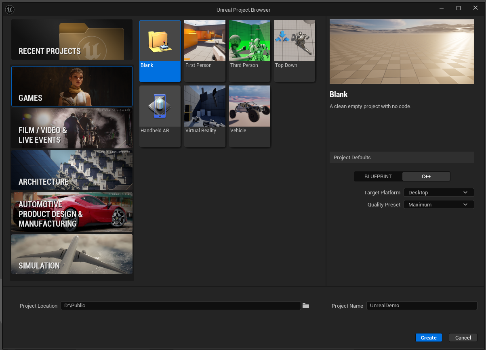

**Use the `Edit` menu and select the `Plugins` menu item.**

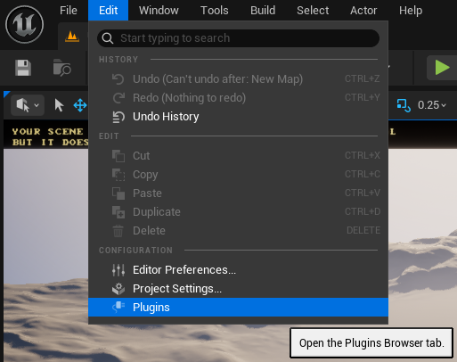

**Search `chroma` to select the `Razer Chroma Devices` plugin.**

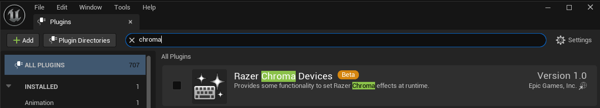

**Activate the plugin and click `Yes` to accept the experimental plugin.**
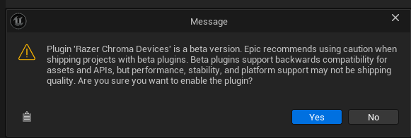

**Click `Restart Now` to relaunch the Unreal Engine with the plugin enabled.**


**The plugin is now enabled.**

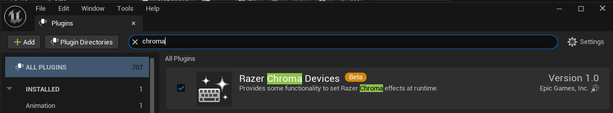

**Use the `Edit` menu and select the `Project Settings` menu item.**

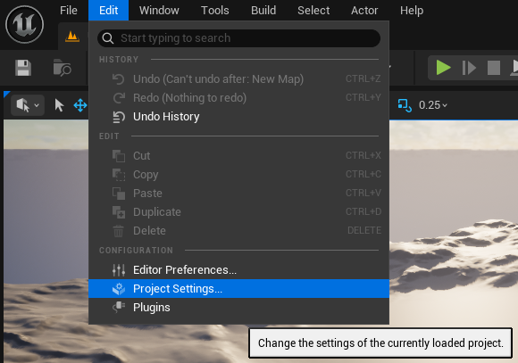

**Scroll down to the `Plugins` section and select the `Razer Chroma Settings` project settings.**

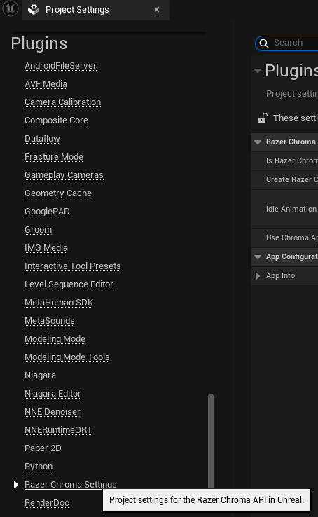

**Check `Create Razer Chroma Input Device` and expand `App Info` to update the details for `Application Title`, `Application Description`, `Author Name`, and `Author Contact`**

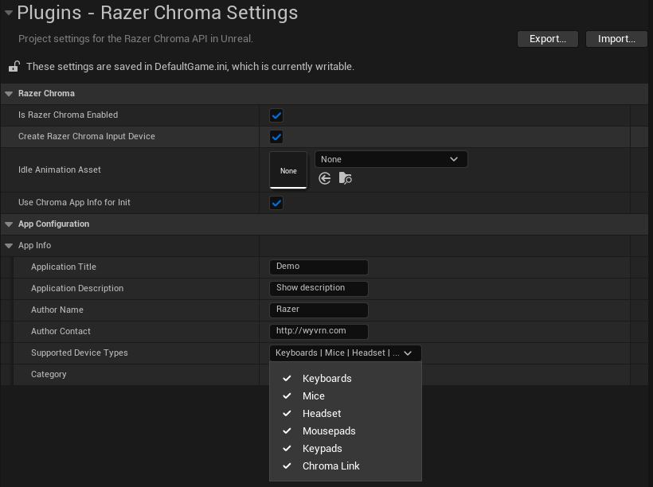

 **The `App Info` specifies details that appear in the `CHROMA APPS` list.**

 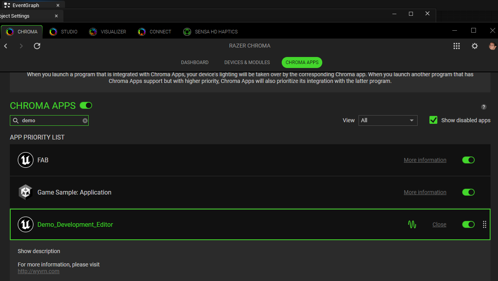

**Open the level blueprint.**

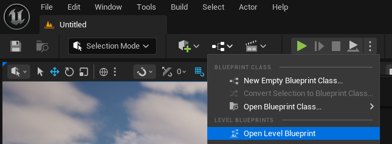

**Create a `Set Event Name` node which is used to trigger Chroma and haptics events by name.**

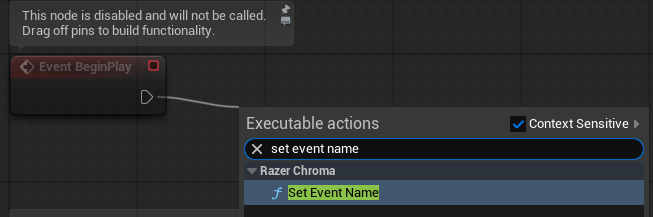

**Name any of your game events and pass the name to `Set Event Name`.**

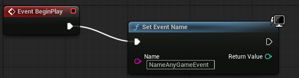

This causes the external command to fire.

```shell
Demo_Development_Editor: play NameAnyGameEvent
```

**Save the level to save the blueprint changes.**
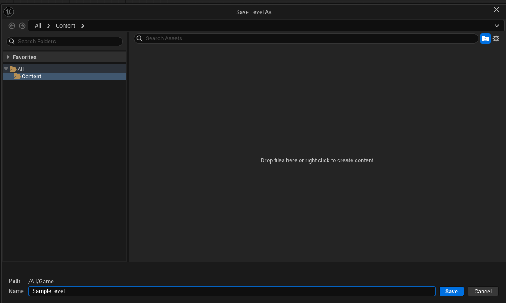

**All `Chroma` and haptics events can be controlled via the [WYVRN Configuration](https://doc.wyvrn.com/docs/wyvrn-sdk/wyvrn-configuration/) and that needs to be created at `C:\Program Files (x86)\InterHaptics\HapticFolders\Title`.**
